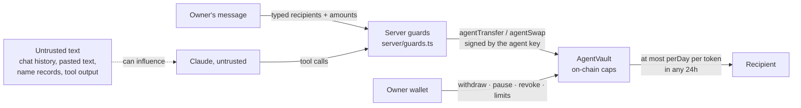

# Security and threat model

Vlora's claim is narrow: **an AI agent can spend from your agent wallet, but it can't drain it.** This page says what that rests on, what is trusted, and what happens when each trusted piece fails.

Status: tested (Foundry unit, fuzz and invariant tests; Vitest for the off-chain guards; Slither) but **not audited**. On the hosted site the agent key is run by the site's server. Treat the agent wallet as beta and fund it accordingly; mainnet caps the daily limit at 50 USDC for that reason.

## Trust boundaries

Everything left of the vault can be wrong or hostile; the vault's limits still hold.

## What is not trusted

| Input | Why it can't move funds on its own |
|---|---|
| The model's output (Claude) | It only proposes tool calls. The server executes a send only if the recipient appears in the owner's **latest** message (address or `.arc` name), the amount parses, and it fits the limits. |
| Chat history, pasted text, web content, `.arc` records | Only the latest owner message is scanned for recipients (`RecipientGuard`). A name the model looks up but the owner didn't type never becomes payable. A 64-hex hash doesn't make its prefix an address. |
| Quotes from LI.FI (mainnet swaps, main app) | The returned transaction is decoded and checked before signing: pinned router, receiver = the user, exact input token and amount, output token, on-chain minimum = reviewed minimum (`src/lib/lifi.ts`). The user still signs it. |
| RPC responses | Used for previews and dry runs. A lying RPC can make a preview wrong, but it can't sign anything: every main-app transaction is signed by the user's wallet, and the vault enforces its own caps. If the chain can't be read, signing is blocked (fail-closed). |

## What is trusted, and the worst case if it fails

| Trusted piece | If it's compromised or wrong | Worst case |
|---|---|---|
| **Agent key** (`AGENT_PRIVATE_KEY`, one key on the server) | The attacker can call `agentTransfer`/`agentSwap` on every vault that trusts this key, to any recipient. | Per vault: at most `perDay` per token in any 24-hour period (v2 vaults, enforced on-chain), until the owner pauses or revokes. It can never withdraw, change limits, or re-point the vault. **Because the key is shared, all vaults are exposed at once**, each to its own cap. Per-vault keys would remove that correlation (not built yet). |
| **The agent server** (guards, rate limits) | Bypassing the guards gets the same power as the agent key: the vault's caps still apply. | Same as above. |
| **`AgentVault` contract code** | A bug could break the caps. | Unbounded, which is why it's covered by unit, fuzz and invariant tests (below) and why mainnet vaults are capped at 50 USDC/day. |
| **Swap router** (Synthra, fixed at deploy) | A bad or manipulated pool can give a poor price. | Swap *input* counts toward the daily cap, and output always returns to the vault, so a bad price loses at most the capped input. The minimum-output check is set by the server (the agent must pass a non-zero `minOut`); there is no on-chain oracle bound. |
| **Circle Facilitator** (gasless sends) | Circle submits a transfer the user already signed (EIP-3009). | It can only move exactly what was signed, to whom it was signed for, before it expires (10 minutes). It can't change amount or recipient. |
| **The owner's wallet** | Out of scope: the owner can withdraw everything by design. | — |

## The daily limit is a rolling 24-hour window

`AgentVault` v2 keeps the last 32 agent spends per token and sums those less than 24 hours old. So for any two spends less than 24 hours apart, the later one saw the earlier one, and **the total over any 24-hour period is at most `perDay`**. There's no midnight reset to exploit. If 32 spends are already inside the window, the next one reverts rather than forgetting one.

v1 vaults (the first factory) used calendar-day buckets, which let a compromised key spend up to 2× the cap across midnight. For v1 vaults the server enforces the rolling bound itself (today + yesterday ≤ `perDay`), but on-chain only the calendar-day limit applies. The panel flags v1 vaults and suggests moving to a new one.

## How the claims are tested

| Claim | Test |
|---|---|
| Total agent spend in any 24h ≤ `perDay`, including across midnight | `invariant_NeverMoreThanCapInAny24Hours` (Foundry invariant, 256 runs × 500 calls with random time jumps). Against the v1 contract this invariant **fails** (101.97 > 100 USDC), so it catches the bug it was written for. |
| Window accounting is consistent | `invariant_WindowAccountingAddsUp`, `test_NoMidnightReset_RollingWindow`, `test_WindowReleasesSpendsOneByOne`, `test_TooManySpendsInWindow_NeverForgetsALiveSpend` |
| Agent can't use owner controls, strangers can't act, paused/expired/revoked agents are blocked, swaps pay out to the vault and clear approvals | `contracts/test/AgentVault.t.sol` |
| Recipients must come from the owner's latest message; model-suggested names rejected | `server/guards.test.ts` |
| Server caps (per-tx, 24h, beta cap, v1 midnight guard) | `server/guards.test.ts` |
| Every send is validated and fails closed without a balance | `src/utils/validateSend.test.ts` |

CI (`.github/workflows/ci.yml`) runs all of the above, plus typecheck, lint and build, on every push.

## Static analysis

Slither 0.11 on `contracts/` (excluding tests and scripts): 7 results, none high or medium.

| Finding | Assessment |
|---|---|
| `uninitialized-local`: `total` in `BatchSender.batchTransfer` | Intended: Solidity zero-initialises; the sum starts at 0. Left as is so the verified source keeps matching the deployed bytecode. |
| `missing-zero-check`: `agent` in the vault constructor and `setAgent` | Intended: `address(0)` means "no agent" (same as revoked); `onlyActiveAgent` rejects it. |
| `missing-zero-check`: factory `swapRouter` | Harmless in v1 (the vault constructor rejects a zero router); v2 factory now checks it too. |
| `timestamp` (×3): expiry and window comparisons | By design. Validator timestamp drift is seconds; the window is 24 hours. |

## Verified source

| Contract | Network | Verification |
|---|---|---|
| `BatchSender` `0x40D5…a2a9` | Arc mainnet | [Sourcify, exact match](https://repo.sourcify.dev/5042/0x40D5AbC0EcDB140ba4DC5fF3B725c5740a0Ea2a9) |
| `AgentVaultFactory` v1 `0x170F…6C69` | Arc mainnet | [Sourcify, exact match](https://repo.sourcify.dev/5042/0x170FD54D7A9D0d35C0237A5B45741dF874ba6C69) |
| `ArcNames` `0xF2DC…00d9` | Arc mainnet | [Sourcify, exact match](https://repo.sourcify.dev/5042/0xF2DCe7fe2864FDD899b12185c610C11d425200d9) |
| `BatchSender` `0xF2DC…00d9` | Arc Testnet | [Explorer, verified](https://explorer.testnet.arc.io/address/0xF2DCe7fe2864FDD899b12185c610C11d425200d9) |
| `AgentVaultFactory` v1 `0x40D5…a2a9` | Arc Testnet | [Explorer, verified](https://explorer.testnet.arc.io/address/0x40D5AbC0EcDB140ba4DC5fF3B725c5740a0Ea2a9) |

## Reporting

Please report vulnerabilities privately to the repository owner via GitHub rather than opening a public issue.
